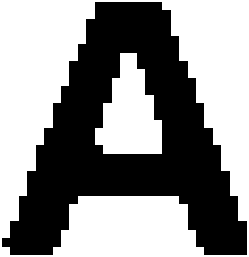
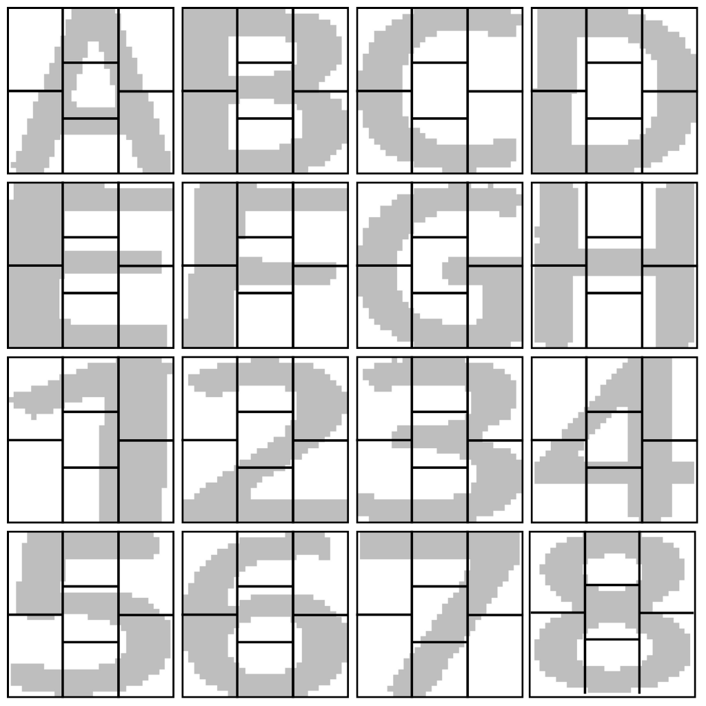
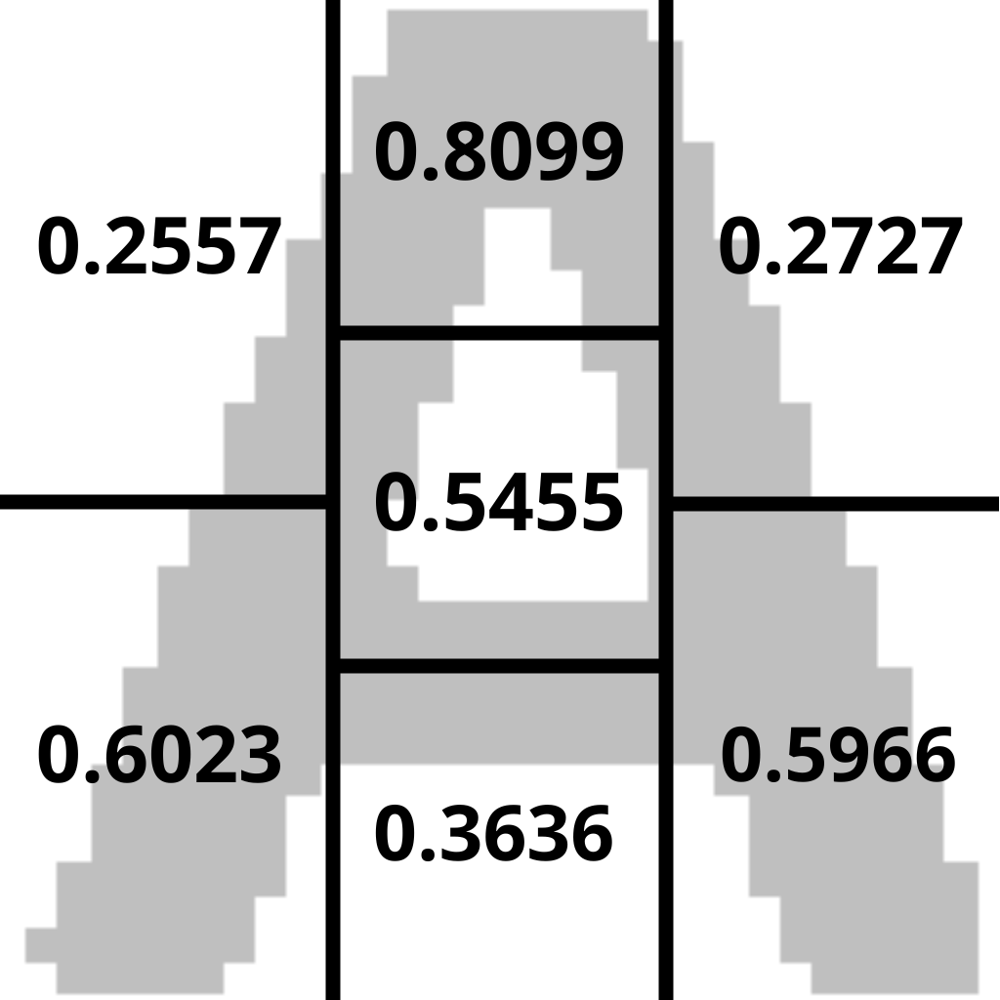
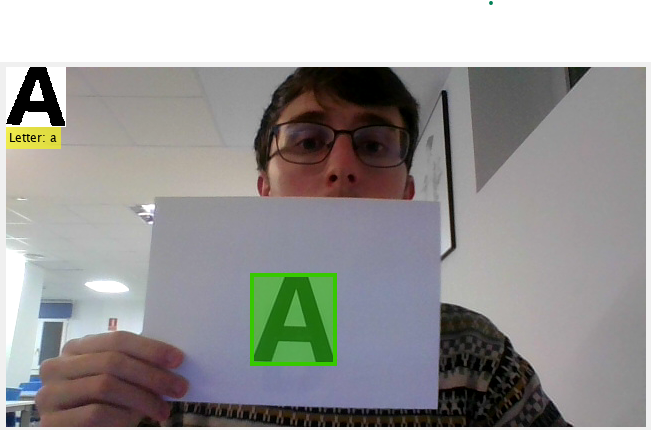
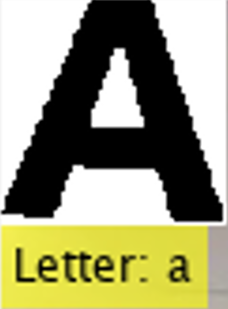

# letersnumbers-classifier
Letters and numbers classifier in real time for chess games using computer vision and neural networks.

## Overview
This project tries to create a way to play chess by showing letters and numbers cards (describe in de folder letters_numbers) in real time, which will return the registered move (for example 'b1d1'), so a chess engine could play and move that piece.

## Methodology
We first trained a neural network model (Feed Forward) using 100 images of each letter and number that were obtained recording a webcam video and storing each frame (in the video we move each card a bit to ensure the network will generalized better each one). The model should do a good work with any similar letter  or number card.

### Preprocessing
Each image was binarized, eroded and dilated (classical computer vision techniques). After that, it was cropped to get a new image getting rid of the background, so we just have the letter or number, and resized the image to 30x30 pixels. Here is an example:

### Feature Extraction
Now we will extract the main features of each letter and number in order to use it as an input. We will be using the 7-segment display concept, that basically divide the image in 7 parts as shown below for every possible card:

And we take the amount of letter/number in that section, that will be use as input for our neural network.

### Training
We will use those inputs to train a Feed Forward network with an input layer with 7 neurons, a single hidden layer with 10 neurons and a output layer with 8 neurons (since we will be using one network to classify letters and another for numbers).

The split will be: 80% (80 images) for training and 20% (20 images) for testing so we can know how good our network is, but after that we will use every image to train the model to get as much examples as possible.

### Results and conclusion
The predictions were fast enough to use then in real time, and good enough to classify each card in good conditions, but also with a bit of rotation added.

# MATLAB dependencies
- Deep Learning Toolbox
- Image Processing Toolbox
- Statistics and Machine Learning Toolbox
- Computer Vision Toolbox
